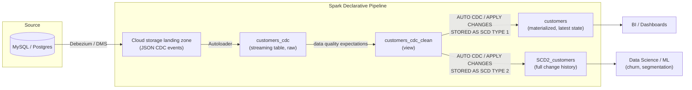

# Declarative Pipeline CDC

Change Data Capture (CDC) on Databricks using **Spark Declarative Pipelines** (SDP, formerly Delta Live Tables). This project ingests CDC events for a retail `customers` table and materializes them into a clean, up-to-date Delta table — with a parallel example showing how the same pattern scales to N tables, and how to keep full history with Slowly Changing Dimension Type 2 (SCD2).

Exported from a Databricks workspace (`dbdemos` asset), this repo mirrors the notebooks/scripts as they exist in the Lakeflow Declarative Pipeline, in both **SQL** and **Python** flavors.

## Why CDC?

Upstream systems (MySQL, Postgres, etc.) emit a stream of row-level changes — inserts, updates, deletes — usually captured by a tool like Debezium, Fivetran, or AWS DMS and landed as JSON files in cloud storage. Rather than re-loading the whole source table on every run, CDC lets you replay just the changes and keep a Lakehouse table in sync incrementally.

## Architecture



### Pipeline stages

1. **Ingest with Autoloader** — incrementally read newly landed CDC JSON files from the storage volume, with schema inference and schema evolution handled automatically.
2. **Cleanup & expectations** — a view enforces data quality constraints (id not null, valid operation type, no rescued/malformed JSON) and drops rows that fail.
3. **Materialize with `APPLY CHANGES` / `AUTO CDC`** — upserts (and deletes) are applied against the target table, keyed by `id` and ordered by `operation_date`, producing a table that always reflects the latest state (`STORED AS SCD TYPE 1`).
4. **SCD Type 2 (optional)** — the same CDC stream is applied with `STORED AS SCD TYPE 2` to retain a full history of every change, useful for auditability and point-in-time analysis.

The Python version (`2-sdp-python`) generalizes step 1–3 into a loop so the same logic scales across every table found under the raw data volume, instead of hand-writing one table per source.

## Repository layout

```
.
├── 01-Retail_Pipeline_CDC_SQL.py          # Top-level walkthrough notebook (narrative + links)
├── 1-sdp-sql/
│   ├── transformations/
│   │   └── 01-sql_cdc_pipeline.sql        # Single-table CDC pipeline, written in SQL
│   └── explorations/
│       └── sample_exploration.py          # Ad-hoc notebook to browse the raw CDC data
├── 2-sdp-python/
│   ├── transformations/
│   │   └── 01-full_python_pipeline.py     # Multi-table CDC pipeline + SCD2, written in Python
│   └── explorations/
│       └── sample_exploration.py
└── _resources/
    ├── 00-Data_CDC_Generator.py           # Generates synthetic customers/transactions CDC data with Faker
    ├── README.py                          # Notes on these helper/setup notebooks
    ├── LICENSE.py                         # Databricks license terms (see below)
    └── NOTICE.py
```

## Data model

The generator (`_resources/00-Data_CDC_Generator.py`) fakes two CDC streams as JSON, written to a Unity Catalog volume:

- **`customers`** — `id`, `firstname`, `lastname`, `email`, `address`, `operation`, `operation_date`
- **`transactions`** — `id`, `customer_id`, `transaction_date`, `amount`, `item_count`, `operation`, `operation_date`

`operation` is one of `APPEND`, `UPDATE`, `DELETE` (plus a small fraction of nulls/bad ids, to exercise the data-quality expectations).

## Running it

1. In Databricks, create a Lakeflow Declarative Pipeline pointing at either `1-sdp-sql/transformations/01-sql_cdc_pipeline.sql` or `2-sdp-python/transformations/01-full_python_pipeline.py` as its source.
2. Set the pipeline configuration values `catalog` and `schema` (used to resolve `/Volumes/<catalog>/<schema>/raw_data/...`).
3. Run `_resources/00-Data_CDC_Generator.py` once to seed the raw data volume with synthetic `customers`/`transactions` CDC files (it's a no-op if the folders already exist).
4. Start the pipeline. It will create `customers_cdc` → `customers_cdc_clean` → `customers` (and `SCD2_customers`), or the equivalent per-table tables in the Python version.

## License

This project was exported from a Databricks **dbdemos** sample workspace folder. `_resources/LICENSE.py` and `_resources/NOTICE.py` carry Databricks' own license terms for that demo content, which restrict derivative works outside of a Databricks Platform Services agreement — review those files before reusing this code beyond personal reference.
